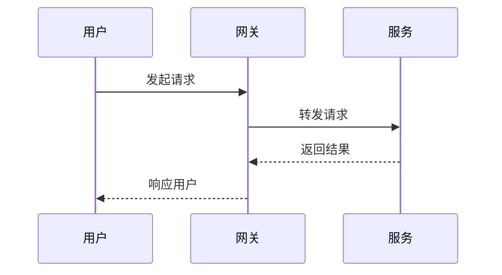

# GoFrame Template For SingleRepo

Quick Start: 
- https://goframe.org/quick

## cli

### 创建迁移文件
    go run main.go migrate create -name=update_user_name

### 执行迁移
    go run main.go migrate up

### 回滚迁移
    go run main.go migrate down

### 初始化 dao
    gf gen dao

### 自动生成 controller

这里需要先在 `api` 中写好对应api 的类型声明再执行下面的命令
    
    gf gen ctrl

### 自动生成 service 接口

这里需要先在 `internal/logic/xxx/` 中写对应的逻辑代码，然后再执行下面的命令

    gf gen service

### 启动项目

    gf run main.go

### 监听job 并执行

    go run main.go jobs

<pre>

</pre>

### test